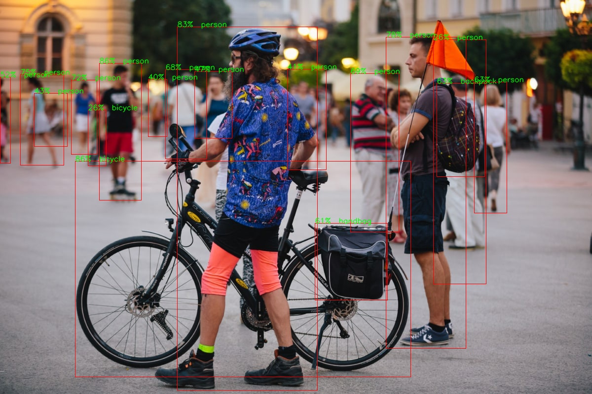

# YOLOV5: Image detection model
This repository contains an executable demonstration of YOLO and Tensorflow implementation for image detection.

## 1. Requirements Installation


## Installation
can be installed from PyPI using `pip` or your package manager of choice:

```bash
pip install git+https://github.com/berezerker/yolov5_package/
```
## Usage

This model implemention is executable as a CLI tool using the `yolov5_package` command. 
A basic model is given inside the package. Also runs with a provided image.

To be able to see the default working of the demo, simply type demo in the terminal and hit Enter.
```bash
demo
```

# pre-commit usage
To check for formatting errors, black and pylint was added.
Usage:
```bash
black .
```
It will modify files to be more appealing for working.
Pylint was added to pre-commit hooks, same as black.
The following command will display all the warnings and errors in formatting:
```bash
 pre-commit run -a
 ```
 After that, one can safely commit all changes.
 
 # Working with docker
 to setup docker, from root folder type the following:
 ```bash
 docker build -t nms_builder .
 ```
 then launch the docker after the build finished
 ```bash
 docker container run --name first_try -p 8501:8501 -it -d nms_builder bash && docker container exec -it first_try bash
 ```
 change the directory for data/yolov5_stream_demo/
 ```bash
 cd data/yolov5_stream_demo
 ```
 launch streamlit web_demo:
 ```bash
 streamlit run web_demo.py
 ```
 after that, go in your web browser to localhost:8501, there you should see web app opened with a spot to upload an image



